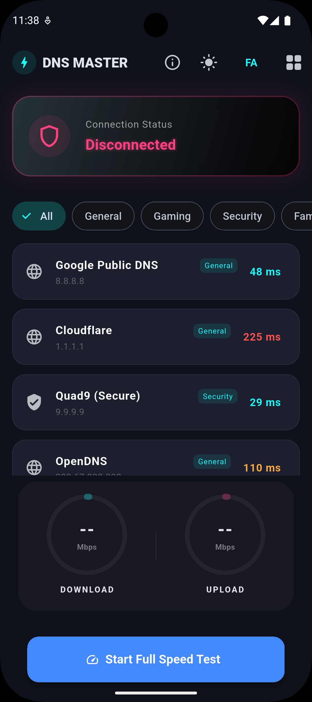
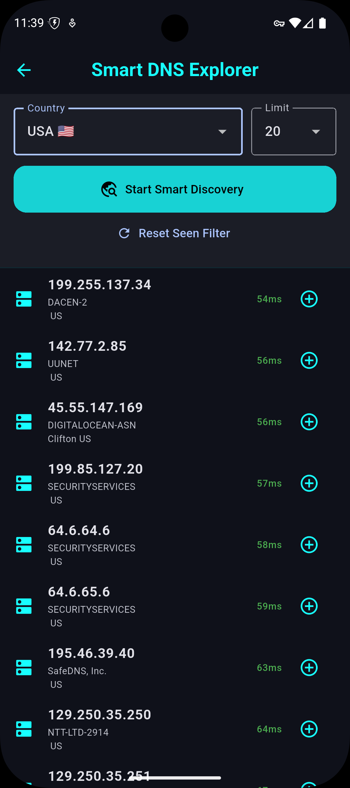

# 🛡️ DNS Master Pro
> **A Smart, High-Performance DNS Explorer & Changer for Android.**

DNS Master Pro is a modern tool built with Flutter that allows users to discover, benchmark, and apply the fastest DNS servers globally. It features a unique "Smart Finder" to scan DNS servers by country and measure real-time latency.

---

## 🚀 Key Features

* **🌐 Smart Discovery:** Automatically fetch and filter public DNS servers from global databases.
* **⚡ Latency Benchmark:** Real-time ping testing to find the lowest latency DNS for your ISP.
* **🌍 Geo-Filter:** Search for DNS servers by specific countries to optimize local routing.
* **🎨 Premium UI:** A sleek, modern dark-mode design with Cyan accents for a high-end feel.
* **🔄 Custom DNS:** Add, manage, and toggle your own custom DNS configurations.
* **🇮🇷 Bilingual Support:** Native support for English (LTR) and Persian (RTL) layouts.

---

## 🛠️ Technical Implementation

* **Framework:** Flutter (Dart)
* **Data Persistence:** `shared_preferences` for fast local storage.
* **Networking:** `http` package for dynamic server discovery.
* **Optimization:** Fully asynchronous architecture to ensure smooth UI performance during network scans.

---

## 📥 Installation

Follow these steps to run the project locally:

1. **Clone the repository:**
   ```bash
   git clone [https://github.com/MORY65/dns_master_pro.git](https://github.com/MORY65/dns_master_pro.git)
   
2.Install dependencies:
            flutter pub get

3.Run the application:
            flutter run

## 📸 Screenshots

|        Smart DNS Finder        |         Manage Servers         |
|:------------------------------:|:------------------------------:|
|  |  |

|       Connection Status        |       Search by Country        |
|:------------------------------:|:------------------------------:|
|  |  |


📄 License

This project is licensed under the MIT License. You are free to use, modify, and distribute the code


Developed with ❤️ by MORY65